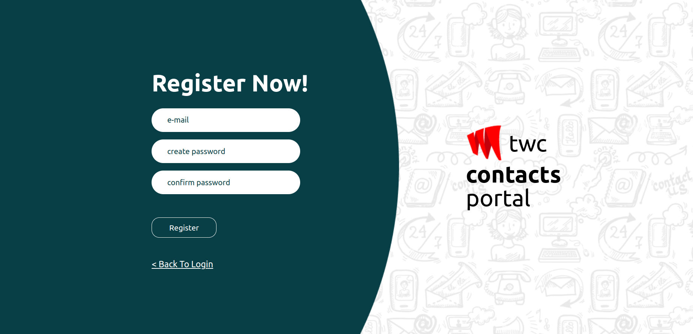

# TWC CONTACTS PORTAL APP

## Version
0.1.0

## Introduction

Welcome to our Contacts Management System, This system allows users to register and log in , and manage their contacts. Users can create, update, and delete contacts, each containing details such as name, gender, email, and phone number. Our backend, powered by Node.js, efficiently handles HTTP requests, user authentication, and database interactions. Alternatively, opt for our Spring Boot backend, offering a Java-powered solution. On the frontend, our React.js .enhanced by TypeScript for a smoother development journey.

### Back-end 
#### NodeJS      - https://github.com/Pravinda-Bandara/twc-test-api
#### Spring-Boot - https://github.com/Pravinda-Bandara/twc-test-api-spring

 

### Features

#### User Features
- **User Authentication:** Users can securely register and log in to access personalized features.
- **Contact Management:** Users can create, update, and delete contacts.
- **Contact Details:** Each contact can contain information such as name, gender, email, and phone number.

 

### Preview
### User Routes

  
  

 

### Contact Routes

  
  
  
  
    
  
    

### Frontend Technologies Used

- **Framework:** React
- **Styling:** Tailwind CSS
- **State Management:** Context API
- **HTTP Client:** Axios and React Query
- **Toast Notifications:** React Toastify

### Backend Technologies Used

- **Framework:** Node.js with Express
- **Database:** MongoDB with Mongoose
- **Object Modeling:** Typegoose

## Usage Disclaimer

This project and its associated images are used for educational and learning purposes. The application and any included images are not intended for commercial use.

## License

Copyright &copy; 2024 [Your Name]. All Rights Reserved  
This project is licensed under the [MIT License](LICENSE.txt).
